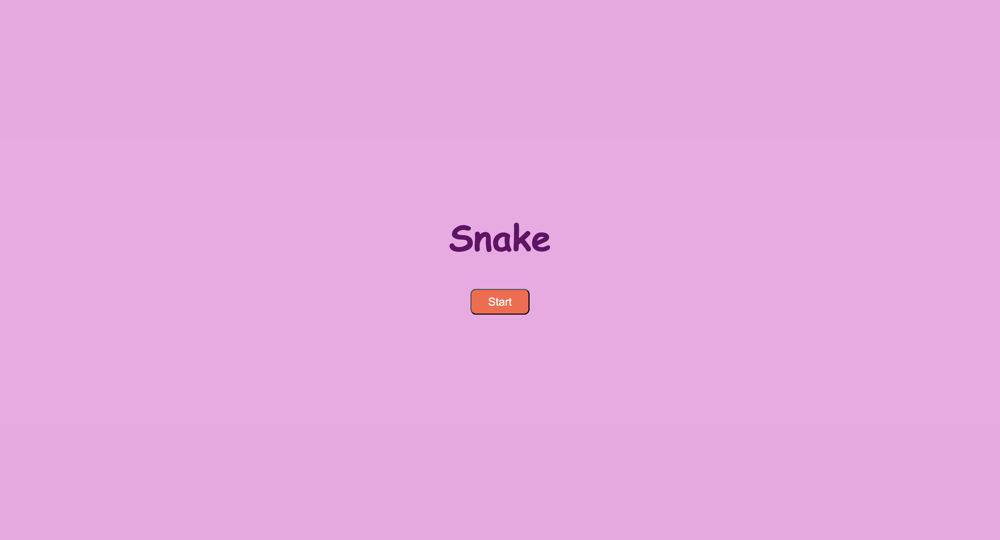

# Snake Game 🐍

A classic snake game with two difficulty levels, built using HTML, CSS, and JavaScript.

## Description

In this grid-based snake game, players navigate a snake to consume food and avoid obstacles. The game features two levels of increasing difficulty:

### Level 1
- Collect food to grow the snake
- Avoid colliding with walls and snake's body
- Win condition: Score 5 points

### Level 2
- Same mechanics as Level 1
- Additional obstacles ("💩") appear on the grid
- Win condition: Score 20 points

## How to Play

### Starting the Game
1. Click the "Start" button
2. Select Level 1 or Level 2 from the level selection screen

### Controls
- Use arrow keys to control the snake:
  - ⬆️ Up
  - ⬇️ Down
  - ⬅️ Left
  - ➡️ Right

### Game Rules
- Eating food:
  - Increases snake length by one unit
  - Adds one point to score
  - Spawns new obstacles in Level 2
- Game Over conditions:
  - Hitting walls
  - Colliding with snake's body
  - Hitting obstacles (Level 2)

## Technical Features

### Technologies Used
- HTML
- CSS
- JavaScript
- GitHub

### Game Components
- Start screen with game title and button
- Level selection screen
- Game board with:
  - Dynamic snake movement
  - Random food generation
  - Obstacle placement (Level 2)
  - Score tracking
  - Win/lose messages

## Development Process

### Key Learnings
- Implementation of various JavaScript methods
- Usage of do-while loops for clean code
- Code optimization and conciseness
- Game state management

### Challenges Overcome
- Maintaining obstacle persistence on screen
- Managing HTML-JavaScript interactions
- Interval clearing implementation
- Function syntax optimization
- Do-while loop refinement
- Separating game logic from display logic

## Future Enhancements

Planning to implement:
- Variable snake speeds
- Pass-through walls option
- Power-ups with invincibility frames

## User Stories

1. Start game via "Start" button
2. Choose between Level 1 and 2
3. Control snake movement with arrow keys
4. Collect food to grow snake and score points
5. Navigate through obstacles
6. View score updates
7. Restart game after win/loss
8. Return to start screen via "Play Again" button

## Win/Lose Conditions

### Win Conditions
- Level 1: Score 5 points
- Level 2: Score 20 points

### Lose Conditions
- Level 1: Collision with walls or snake body
- Level 2: Same as Level 1 plus obstacle collisions

## Wireframe Structure
- Start screen (title + start button)
- Level selection screen
- Game board with:
  - Colored background
  - Snake
  - Food items
  - Obstacles (Level 2)
  - Message display
  - Play Again button